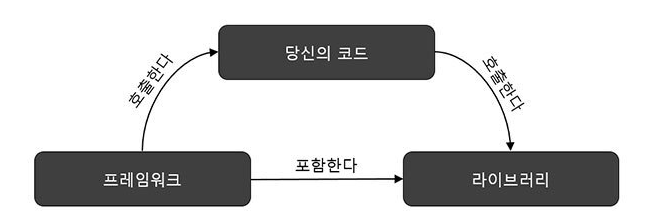

# React

React는 사용자 인터페이스를 구축하기 위한 선언적이고 효율적이며 유연한 JavaScript 라이브러리입니다. “컴포넌트”라고 불리는 작고 고립된 코드의 파편을 이용하여 복잡한 UI를 구성하도록 돕습니다.

**탄생배경 :**\
Facebook 팀의 React 개발은 특히 데이터가 자주 변경되는 대규모 애플리케이션에서 사용자 인터페이스를 구축하고 관리하는 보다 효율적인 방법에 대한 필요성에 의해 추진되었다.

**효율적 방법 :**\
선언적 UI, 컴포넌트 기반, 가상 DOM, 단방향 데이터 흐름

## React 컴포넌트 란?

***

컴포넌트는 자체 로직과 외형을 가진 사용자 인터페이스 UI의 한 부분이다.\
UI를 작은 단위로 나누어 조합하는 방식을 사용하기 때문에 코드의 재 사용이 효율적이며 유지 보수 편의성을 확보하여 개발 생산성을 높여준다.


## 어떤 값이 State가 되어야할까?

***

```jsx
⚠️ 부모로 부터 `props`를 통해 전달됩니까? 
-> 그러면 `props`가 아닙니다.
["props로 전달된 값을 다시 state로 바꾸지 마라"]

⚠️ 시간이 지나도 변하지 않나요? 
-> 그러면 `state`가 아니다.
["시간이 지나도 변하지 않는 값은 상수값으로 사용하자"]

⚠️ 컴포넌트 안의 다른 `state`나 `props`를 
가지고 계산 가능한가요? 
-> 그렇다면 `state`가 아닙니다.

```

## React 리렌더링

***

리액트의 모든 리렌더링은 상태 변경에서 시작된다.\
컴포넌트의 상태나 props가 변경시\
이전의 가상 DOM와 현재의 가상 DOM을 비교하여 \
변경된 부분만 잘라 실제 DOM에 반영한다.

1. 컴포넌트의 상태가 변경될때
2. Props 변경시
3. 부모 컴포넌트 리렌더링
4. this.forceUpdate() 메서드 호출

## IoC(Inversion of Control) 제대로 이해 못함

전통적인 프로그래밍 접근법에서는 개발자는 프로그램의 시작부터 끝까지 어떤 함수가 언제 호출될지, 어떤 이벤트가 언제 발생할지 결정한다. 즉 모든 프로그램의 흐름과 실행 순서를 개발자가 직접 관리하고 제어한다.

제어의 역전에서는 프로그램의 흐름이 프레임워크에 의해 관리된다. 개발자는 필요한 로직만을 구현하고, 프로그램의 흐름 제어는 외부 프레임워크에 위임한다.

## Library vs Framework



라이브러리 : 개발자가 애플리케이션 흐름을 제어하며 필요할 때 라이브러리 에서 제공하는 기능을 호출한다.\
프레임워크 : 제어의역전(IoC) 원칙을 따르며, 프레임워크가 애플리케이션의 흐름을 관리한다. 개발자는 프레임워크가 정한 규칙과 구조 내에서 코드를 작성한다.

React는 컴포넌트를 사용하여 UI를 구성하는 방식을 제공 할 뿐 특정 구조나 패턴을 강요 하지 않는다. 반면 Next.js의 경우 React의 기반이며 페이지 라우팅 시스템와 같은 구조화 되어 이기때문에 프레임워크이다.????

[제어의 역전](https://martinfowler.com/bliki/InversionOfControl.html)(IoC: Inversion of Control)이 Framework의 주요한 특징이고, React는 IoC를 통해 상태와 업데이트가 얽힌 복잡한 상황을 간단히 선언형 UI로 구성하는 혜택을 누린다(이게 바로 React의 첫 번째 특징이다). 그 누구도 매번 root를 render하는 방식으로 쓰면서 “이게 라이브러리지!”라며 감탄하지 않는다.

하지만 일반적으로는 (Martin Fowler의 개탄처럼) IoC는 IoC 컨테이너와 엮여서 DI와 동의어처럼 쓰이고, Next.js, Remix 같은 걸 Framework이라고 부르니 면접 때 괜히 이런 걸로 싸우지는 말자. “리액트 개발자가 이렇게 이야기했다니까요!”라고 해봐야 서로 감정만 상할 뿐이다.

***

[Git](https://github.com/gaearon/overreacted.io/blob/archive/src/pages/react-as-a-ui-runtime/index.ko.md)\
[프론트엔드에서의 Inversion of Control](https://tecoble.techcourse.co.kr/post/2021-05-14-inversion-of-control/)\
[이제부터 이 컴포넌트는 제 겁니다 | 카카오엔터테인먼트 FE 기술블로그](https://fe-developers.kakaoent.com/2022/221110-ioc-pattern/)\
[프레임워크와 라이브러리의 차이점](https://webclub.tistory.com/458)
