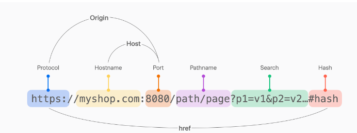

# Fetch API & CORS

## FetchAPI

***

웹 브라우저에서 리소스를 비동기적으로 가져오는 기능을 제공하는 JavaScript인터페이스

### 역사 및 필요성

기존에는 `XMLHttpRequest` 가 웹에서 서버와의 비동기 통신을 처리하는 표준 방법이었다. 하지만 사용방식도 복잡하고 콜백을 통한 처리 때문에 코드에 가독성도 많이 떨어졌다. `fetchAPI`는 쉽게 비동기 통신을 처리 할 수 있고 `Promise`기반이라 코드의 가독성 또한 높아졌다.

### 특징

> **Promise 기반** : fetchAPI는 자바스크립트의 Promise를 반환한다.\
> **유연성** : 요청과 응답 모두에 대한 세부 설정이 가능하여, 헤더 설정, 캐시 제어, CORS설정 등을 유연하게 처리할 수 있다.  
> **CORS** : CORS에 대한 처리를 지원한다.\
> **스트림 응답** : 결과를 스트림으로 처리할 수 있어 큰 데이터를 처리하는 경우 유용하다.

```jsx
fetch('https://api.example.com/data', {
  method: 'POST', // HTTP 메서드 설정
  headers: {
    'Content-Type': 'application/json'
  },
  body: JSON.stringify({
    key: 'value'
  }) // 요청 본문
})
    .then(response => response.json())
    .then(data => console.log(data))
    .catch(error => console.error('Error:', error));
```

## Promise

***

javaScript에서 Promise는 비동기 연산의 결과를 나타내는 객체\
Promise는 비동기 작업이 성공적으로 끝났을 때 결과 값을 처리하거나, 실패했을 때 오류를 처리하는 방법을 제공한다.

### Promise의 등장배경

이전에는 주로 콜백 함수를 사용하여 비동기 작업을 처리했지만, 복잡한 작업에서 콜백 지옥이 형성 되는 문제를 해결하고자 `Promise`가 도입되었다.

### Promise의 특징

상태 : Promise는 세 가지 상태를 가진다.

* Pending(대기 중) : 초기 상태, 비동기 처리가 아직 완료되지 않음
* Fulfilled(이행됨) : 연산이 성공적으로 완료됨
* Rejected(거부됨) : 연산이 실패함

**불변성** : 한번 fullfilled 나 Rejected 같은 상태가 되면, 그 상태로 고정된다.

**체이닝** : Promise는`.then()`,`.catch()`, `.finally()`메소드를 사용하여 연속적인 비동기 작업을 쉽게 처리할 수 있다.

### 사용 방법

생성 : 새 Promise는 `new Promise()`생성자와 함께 만들어진다.\
생성자는 `resolve`와 `rejected`라는 두 개의 인수를 가진 함수를 받는다.

```javascript
let promise = new Promise((resolve, rejeted) => {
    if(/*성공적인 처리 조건 */) {
        resolve('Sucess!');
    } else {
        rejected('Fuilure');
    }
    });
```

## ReableStream

***

데이터를 조각별로 읽을 수 있는 인터페이스\
데이터를 메모리에 한 번에 모두 로드하지 않고 조금씩 읽을 수 있어, 큰 크기의 데이터를 효율적으로 처리할 수 있다.

```javascript
fetch("http://localhost:3000/products");
// → Promise

await fetch("http://localhost:3000/products");
// → Response

const response = await fetch("http://localhost:3000/products");
// → response.body는 ReadableStream

const reader = response.body.getReader();

const chunk = await reader.read();
// → chunk.value는 Uint8Array 타입.
// → 원래는 chunk.done이 true일 때까지 반복해야 한다.

const body = new TextDecoder().decode(chunk.value);

const data = JSON.parse(body);
```

> 대량의 데이터를 처리할 때는 위와같은 방법이 매우 유용하지만, 단순 JSON 데이터를 다루는 경우는 .json()메소드가 기본으로 데이터를 읽을수 있게 지원을 해준다. 

## Unicode

***

유니코드(Unicode)는 전 세계의 모든 문자를 공통된 코드로 표현하기 위해 만들어진 국제 표준이다.

> 소프트웨어와 시스템이 텍스트 데이터를 교환하고 처리하는 표준방법

## CORS란

***

교차 출처 리소스 공유

> 웹페이지가 다른 도메인의 리소르를 안전하게 요청할 수 있도록 하는 메커니즘이다.  

출처를 구성하는 세 요소는 프로토콜 - 도메인(호스트이름)-포트로( Origin),  
이중 하나라도 다르면 CORS 에러를 만나게 된다.

<figure><figcaption></figcaption></figure>

CORS를 설정한다는 건 출처가 다른 서버 간의 리소스 공유를 허용한다는것  
기본적으로 브라우저는 보안상의 이유로 SOP(Same-Origin Policy)이라는 정책을 적용하여 서로 다른 출처 일때 리소스의 요청에 대해서는 차단이 된다.

> CORS는 이러한 제한을 특정 조건하에 완하여 다른 출처에서 자원을 안전하게 요청할 수 있도록 하는 규칙과 절차를 진행한다. 우리의 머리를 CORS에러 때문에 머리가 아픈 이유는 CORS가 아닌 SOP정책 때문이다. 

### 누가 출처 비교를 하는거야?  

CORS의 출처를 비교하는 것은 서버에 구현된 스펙이 아닌 브라우저에서 구현된 스펙이다.  
그래서 브라우저에는 에러가 뜨지만, 정작 서버 쪽에는 정상적으로 응답을 했다고 하기 때문에 난항을 겪는다. 즉, 응답 데이터는 멀쩡하지만 브라우저 단에서 받을수 없도록 차단을 한다.

### 비교 동작 과정

1. 클라이언트에서 HTTP요청의 헤더에 Origin을 담아 전달 
2. 서버는 응답헤더에 Access-Control-Allow-Origin을 담아 클라이언트로 전달한다.
3. 클라이언트에서 Origin과 서버가 보내준 Access-Control-Allow-Origin을 비교한다.


### 해결책은 서버의 허용 

결국 해결 방법은 서버측에서 Access-Control-Allow-Origin 헤더에 허용할 출처를 담아 클라이언트에 응답하면 된다.   

### CORS의 작동 방식

**예비요청(핵심)**
: Default

브라우저는 먼저 예비 요청을 보내 서버와 잘 통신되는지 확인한 후 본 요청을 보낸다. 
이때 예비요청을 보내는 것을 Preflight라고 부르며, 이 예비요청의 HTTP 메소드를 GET 이나 POST가 아닌 `OPTIONS`가 사용된다는 것이 특징이다. 

1. 브라우저는 먼저 리소스가 있는 서버에 사전 요청(pre-flight request)을 보낸다.
2. 해당 요청은 서버가 교차 출처 요청을 허용하는지 확인하는데 사용된다.
3. 서버가 적절한 CORS헤더로 응답하면 브라우저는 실제 요청을 보내고 리소스에 접근할 수 있다.

### 예비 요청의 문제점과 캐싱 

예비 요청은 특성상 네트워크 지연을 증가시켜 성능에 영향을 줄 수 있다.  
성능 저하 문제를 완화하기 위해, 예비 요청의 결과를 캐싱하는 방법이 있다. 캐싱을 통해 동일한 출처로부터 동일한 리소스 요청이 발생할 때 예비 요청을 재수행하지 않고 캐시된 응답을 사용할 수 있다.  

### 예비요청 캐싱 방법

`Access-Control-Max-Age` 헤더 사용   
서버가 예비 요청의 응답으로 `Access-Control-Max-Age` 헤더를 포함시킬 수 있다. 이 헤더는 브라우저가 예비 요청의 결과를 캐시할 수 있는 최대 시간을 지정한다. 

### CORS 헤더

`Access-Control-Allow-Origin`: 이 헤더는 리소스에 접근할 수 있는 출처를 지정한다.  
특정 출처 또는 와일드카드 `*`를 값으로 가질 수 있다.  

`Access-Control-Allow-Methods`: 실제 요청에서 허용되는 HTTP 메소드를 지정한다.  
`Access-Control-Allow-Headers`: 실제 요청에서 사용할 수 있는 HTTP 헤더를 지정한다.  
`Access-Control-Allow-Credentials`: 이 헤더는 자격 증명(쿠키 등)을 포함한 요청을 허용할지를 나타난다. 이 값을 `true`  

### 정리 

CORS는 주로 HTTP헤더를 사용하여 교차 출처 요청의 허용 여부를 전달한다. `Access-Control-Allow-Origin` 헤더는 특정 출처에서의 요청을 허용하거나 모든 출처를 허용하는 등의 설정을 할 수 있다.

브라우저는 기본적으로 SOP정책을 도입하여 서로 다른 출처의 리소스의 접근을 제한하여 악의적인 사용자가 XSS와 CSRF 같은 웹 공격을 방지합니다. CORS라는 예외 정책을 통해 신뢰할 수 있는 출처의 리소스의 접근을 허용할 수 있습니다. CORS 정책은 프리플라이트 라는 사전 요청을 보내 해당 서버가 `Acess-Control-Allow-Origin` 헤더로 적절한 응답을 할 경우에만 본 요청을 수행합니다.
