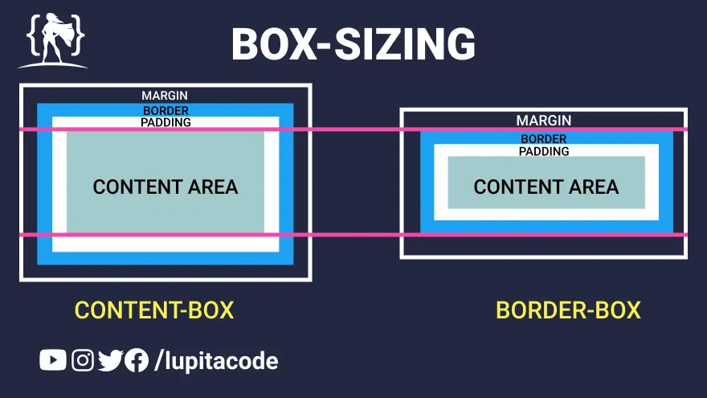

# GlobalStyle & Theme 

## Reset CSS

브라우저 기본 값 초기화 스타일 시트  
각 브라우저마다 기본으로 설정되어 있는 기본 줄 높이, 제목의 글꼴 크기 등과 같은 설정을 초기화 하기 위한 작업이다.

브라우저 불일치를 방지할 수 있다.

## box-sizing 속성

<figure></figure>

웹 요소의 크기 계산 방식을 결정한다.  
기본적으로 CSS에서 요소의 너비와 높이는 내용(content)의 크기만을 포함하지만 `box-sizing`속성을 사용하여 변경 할 수 있다.  

## word-break 속성 

텍스트가 자신의 콘텐츠 박스 밖으로 오버플로 할 때 줄을 바꿀 지 지정한다.  

1. `word-break : normal` : 공백이나 하이픈과 같은 단어 경계에서 줄바꿈이 일어난다.
2. `word-break : break-all` : 규칙에 상관 없이 오버플로가 되면 줄바꿈이 발생한다. 
3. `word-break : keep-all` : 한중일(CJK) 텍스트에서 사용된다. 단어를 쪼개지 않고 줄바꿈을 방지하여, normal과 같이 규칙이 유지된다.  

## Theme  

디자인과 스타일링에 사용되는 설정 및 변수를 담고 있는 객체  
디자인 시스템의 근간을 마련하는데 활용, 잘 정의하면 다크 모드 등에 대응하기 쉽다.  

```jsx
const defaultTheme = {
	colors: {
		background: '#FFF',
		text: '#000',
		primary: '#F00',
		secondary: '#00F',
	},
};

export default defaultTheme;
```

## Theme Provider

`<ThememProvider>` 래퍼 컴포넌트를 내보내어 완벽한 테마 지원을 제공한다.  
컨텍스트API를 통해 그 아래에 있는 모든 React 컴포넌트에 테마를 제공한다.  
렌더 트리에서 모든 스타일컴포넌트는 제공된 테마에 접근할 수 있으며, 여러 깊이에 있더라도 마찬가지다.  