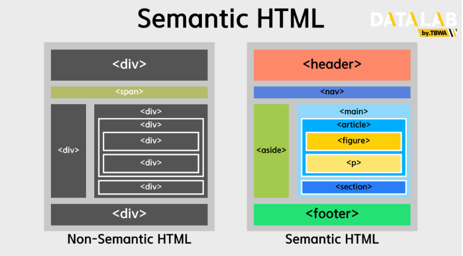

# Style Basic

## className

***

`className`을 사용하면 CSS클래스를 통해 컴포넌트에 스타일을 쉽게 적용할 수 있다.

> 리액트가 JSX를 도입하면서 HTML과 유사한 구조를 자바스크립트 내에서 사용할 수 있게 되었다. 이 과정에서 `class`속성과 자바스크립트의 `class`키워드 간의 충돌을 방지하기 위해 `className` 이라는 새로운 속성을 사용하게 되었다.

## 의미있는 마크업

***

> 시맨틱 태그란 웹페이지의 내용과 구조에 의미를 부여하는 HTML태그이다.\
> 시맨틱 태그의 도입은 웹페이지의 구조를 더 명확하게 표현하고, 검색 엔진 최적화(SEO)접근성, 코드의 가독성을 향상시키기 위한 목적을 가지고 있다.

### 장점 :

1. **검색 엔진 최적화(SEO)** : 검색 엔진은 시맨틱 태그를 이용하여 페이지의 구조를 더 잘 이해하고, 관련 콘텐츠를 적절히 인덱싱 한다.
2. **접근성 향상** : 시각 장애가 있는 사용자가 스크린 리더를 사용할 때, 시맨틱 태그는 페이지의 이해를 돕는다.
3. **유지보수와 코드 가독성** : 웹 페이지의 구조를 더 명확하게 만들어, 코드를 이해하고 유사지보수를 쉽게 한다.

### 주요 시맨틱 태그

<figure><figcaption></figcaption></figure>

`<header>` : 문서나 섹션의 머릿글을 지정하며, 로고, 탐색, 제목 및 기타 소개 정보가 포함된 페이지 상단 부분을 정의한다.\
\-> 메타 태그 정보, CSS링크 스타일, 스타일 시트도 포함되는 경우가 많다.

`<nav` : 웹사이트의 메뉴, 탭, 탐색경로 등 탐색 링크가 포함된 페이지 부분을 정의한다.

`<aside>` : 옆에 위치하는 콘텐츠를 담는 태그, 주로 문서 에서 사이드바를 놓기 위해 사용 된다.

`<main>` : 웹사이트의 텍스트 본문이나 콘텐츠를 나타낸다. `<main>` 태그는 문서에서 유일해야하고, 최상위 태그로 표시된다.

`<article>` : 독립적인 글을 다루느느데 사용하는 태그이다. 블로그 게시물, 뉴스, 기사, 제품 리뷰 등 독립적으로 배포하거나 재사용할 수 있는 독립형 콘텐츠를 정의한다.

`<figure` : 일러스트레이션, 다이어그램, 사진, 코드 목록등과 같은 자체 포함된 콘텐츠를 지정한다.

`figcaption` : 문서에서 사진의 설명을 추가하기 위해 사용된다.

`<section>` : 특정 주제 또는 부제목과 관련된 주제별 콘텐츠 그룹을 정의한다.

`<footer>` : 문서 또는 섹션의 바닥글을 지정하며, 문서의 아래쪽에 위치한다.

`
` : 태그는 사용자가 보거나 숨길 수 있는 추가 세부 정보를 정의하는 태그
