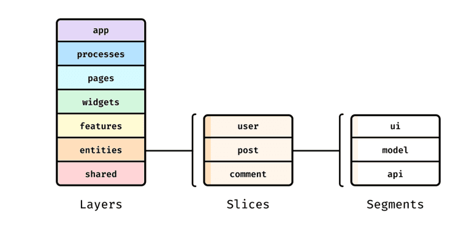

# FSD ( Feature - Sliced Design, FSD)

기능 분할 설계 (Feature - Sliced Design FSD)

<figure><figcaption></figcaption></figure>

> FSD 아키텍처는 프론트엔드 프로젝트를 기능 단위로 나누어 구성하는 패턴으로 복잡한 프로젝트를 관리하기 쉽게 하고 유지 보수성을 높이는 데 중점을 둔다.  
> 각 기능을 독립적인 단위로 나누어 개발과 테스트를 효율적으로 진행할 수 있도록 한다.

---

## Layer

> Layer는 최상위 디렉토리 분해의 첫번째 단계이다.  
> 최대 7개로 제한된다.  
> 각 Layer는 특정 역할을 수행하며, 프로젝트를 체계적으로 구성하는데 도움을 준다.

**app**  : 전역 설정을 담당하는 Layer로   
`Provider`, `Router`, `Client` 등의 설정과 애플리케이션의 진입점이 정의 된다.

**process** : 여러 페이지에 걸친 프로세스를 처리하는 Layer였으나,  
현재는 더 이상 사용하지 않는다.

**pages** : 라우팅에 따라 주소별 페이지를 구성하는 Layer이다.

**widgets** : 페이지에서 사용되는 독립적인 UI 컴포넌트를 포함하는 Layer이다.  
예를 들어, 헤더와 같은 재사용 가능한 UI 컴포넌트가 여기에 위치한다.

**featuers** : 비즈니스 가치를 전달하는 사용자 시나리오와 기능을 다루는 Layer이다.  
 예를 들어 좋아요, 리뷰 작성, 제품 평가 등의 기능이 포함된다.

**entities** : 데이터 모델과 관련된 작업을 다루는 Layer이다.  
사용자, 리뷰, 댓글 등의 데이터와 관련된 기능이 여기에 포함된다.

**shared** : 여러 곳에서 공통적으로 사용하는 컴포넌트와 유틸리티 함수들이 위치하는 Layer이다.  
이 Layer는 slice가 없다.

## Slice 

슬라이스에서 연결은 추상적인 것이 아니라 특정 비즈니스 엔티티에 대한것이다.   
슬라이스의 주요 목표는 코드를 값별로 그룹화하여 유지 보수성을 높이고 코드의 모듈화를 촉진하는 것이다. 

사진 갤러리에는 사진, 앨범 ,갤러리 같은 섹션  
소셜 네트워크에는 게실물, 사용자, 뉴스피드와 같은 슬라이스가 필요하다

## Segment

각 슬라이스는 여러 세그먼트로 구성된다.
세그먼트는 슬라이스 내의 코드를 목적에 따라 나누는 데 도움을 준다.  

**api** - 필요한 서버 요청을 관리한다.  
**UI** - 슬라이스의 UI 컴포넌트  
**model** - 비즈니스 로직, 즉 상태와의 상호 작용. `actions` 및 `selectors`가 이에 해당  
**lib** - 슬라이스 내에서 사용되는 보조 기능.  
**config** - 슬라이스에 필요한 구성값이지만 구성 세그먼트는 거의 필요하지 않음.  
**consts** - 필요한 상수.

## 공개 API

각 슬라이스와 세그멘트에는 공개 API가 있다.  
공개 API는 `index.js` 또는 `index.ts` 파일이다.  
이 파일을 통해 슬라이스 또는 세그먼트에서 필요한 기능만 외부로 추출하고 불필요한 기능은 격리 할 수 있다. 

## 추상화 및 비즈니스 로직 

계층이 높은 레이어일수록 특정 비즈니스 노드에 더 많이 종속되고 더 많은 비즈니스 로직이 포함된다. 계층이 낮은 레이어일수록 추상화 수준이 높고 재사용성이 높으며 레이어 자체의 자율성이 적다. 

<figure><figcaption></figcaption></figure>

## 모듈식 아키텍처의 문제점 

고전적인 아키텍처의 단점은 시간이 흐를수록 더욱분명해진다. 프로젝트가 진화할수록 애플리케이션 아키텍처는 엉망진창이 되어 버린다. 

고전적인 아키텍처는 지속적인 유지보수가 없는 작은 프로젝트나 개인 프로젝트에는 적합하다.

대표적인 단점 

- 기능을 어떤 모듈이나 컴포넌트에 넣을지 명확하지 않을 때가 있다.
- 다른 모듈 내에서 모듈 사용에 어려움이 있다.
- 비즈니스 엔티티를 저장하는 데 문제가 있다.
- 글로벌 함수의 암시적 종속성으로 인해 구조가 복잡해진다.

복잡하거나 적당히 복잡한 프로젝트의 경우, 단순한 모듈식 아키텍처보다 기능 분할 설계를 선호해야 한다. FSD는 많은 근본적인 아키텍처 문제를 해결하며 단점도 거의 없다.