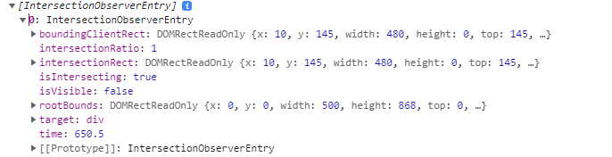

# Intersectionobserver

> Intersection Observer API를 사용하면 웹페이지에서 어떤 요소가 뷰포트(viewport)에 보이는지, 혹은 어떤 요소가 뷰포트를 벗어났는지를 감지할 수 있다. 이를 활용해 사용자가 웹페이지의 어떤 부분을 보고 있는지, 어떤 요소가 화면에 보이는지를 알 수 있다.

## 장점

### 성능

- 스크롤 이벤트는 사용자가 스크롤할 때마다 이벤트를 발생시키기 때문에 성능에 부담을 줄 수 있다. 반면에, `IntersectionObserver API`는 브라우저의 내부적인 최적화를 통해 비동기적으로 작동한다. 더 적은 계산 리소스를 사용하고, 따라서 더 높은 성능을 낼 수 있다.

### 코드 간결성

- 스크롤 이벤트를 사용하여 요소의 위치를 확인하려면 상당히 복잡한 코드가 필요할수 있다. 하지만 `intersection Observer API`는 이런 복잡함 없이도 동일한 결과를 얻을 수 있다.

---

## Intersection Observer 생성하기

- intersection observer를 생성하기 위해서는 생성자 호출 시 콜백 함수를 제공해야 한다.
- 이 콜백 함수는 `threshold`가 한방향 혹은 다른 방향으로 교차할 때 실행된다.
- ?`threshold` : 1.0은 대상 요소가 root에 지정된 요소 내에서 100% 보여질 때 콜백이 호출 될 것을 의미한다.

### Intersection Observer 설정

```jsx
let options = {
  root: document.querySelector("#scrollArea"),
  rootMargin: "0px",
  threshold: 1.0,
};

let observer = new IntersectionObserver(callback, options);
```

- **root :**
  - 대상 객체의 조상 요소
  - 기본값 & `null`은 브라우저 뷰포트
- **rootMargin :**
  - `root` 요소의 각 측면의 `bounding box`를 수축시키거나 증가시키며, 교차성을 계산하기 전에 적용된다.
  - 기본값은 0
- **threshold**
  - `observer`의 콜백이 실행될 대상 요소의 가시성 %를 나타낸다.

---

## Callback

> 관찰할 대상(`Target`)이 등록되거나 가시성(`Visibility`, 보이는지 보이지 않는지)에 변화가 생기면 관찰자는 `callback`을 실행한다.

```jsx
const io = new InteresectionObserver((entries, observer) => {}, options);
io.observe(element);
```

### entries

`entries`는 IntersectionObserverEntry 인스턴스의 배열이다.  
IntersectionObserverEntry는 읽기 전용(Read only)

```jsx
const io = new IntersectionObserver( (entries, observer) => {
	entries.forEach(entry => {
		console.log(entry)
}), options)
io.observe(element)
```

- `boundingClientRect` : 관찰 대상의 사각형 정보
- `intersectionRect` : 관찰 대상의 교차한 영역 정보
- `intersectionRatio` : 관찰 대상의 교차한 영역 백분율
- `isIntersecting` : 관찰 대상의 교차 상태(Boolean) 👍👍👍👍👍
- `rootBounds` : 지정한 루트 요소의 사각형 정보
- `target` : 관찰 대상 요소(Element)
- `time` : 변경이 발생한 시간 정보

<figure><figcaption></figcaption></figure>

---

## Methods

### observe()

대상 요소의 관찰을 시작한다.

```jsx
const io1 = new IntersectionObserver(callback, options);
const io2 = new IntersectionObserver(callback, options);

const div = document.querySelector("div");
const li = document.querySelector("li");
const h2 = document.querySelector("h2");

io1.observe(div); // DIV 요소 관찰
io2.observe(li); // LI 요소 관찰
io2.observe(h2); // h2 요소 관찰
```

### unobserve()

대상 요소의 관찰을 중지한다.  
관찰을 중지할 하나의 대상 요소를 인수로 지정해야 한다.

```jsx
const io1 = new IntersectionObserver((entries, observer) => {
  entries.forEach((entry) => {
    // 가시성의 변화가 있으면 관찰 대상 전체에 대한 콜백이 실행되므로,
    // 관찰 대상의 교차 상태가 false일(보이지 않는) 경우 실행하지 않음.
    if (!entry.isIntersecting) {
      return;
    }
    // 관찰 대상의 교차 상태가 true일(보이는) 경우 실행.
    // ...

    // 위 실행을 처리하고(1회) 관찰 중지
    observer.unobserve(entry.target);
  });
}, options);
```

### disconnect()

`intersectionobsever` 인스턴스가 관찰하는 모든 요소의 관찰을 중지한다.

```jsx
const io1 = new IntersectionObserver(callback, options);
const io2 = new IntersectionObserver(callback, options);

// ...

io1.observe(div);
io2.observe(li);
io2.observe(h2);

io2.disconnect(); // io2가 관찰하는 모든 요소(LI, H2) 관찰 중지
```

### takeRecords()

IntersectionObserverEntry 객체의 배열을 반환한다.
