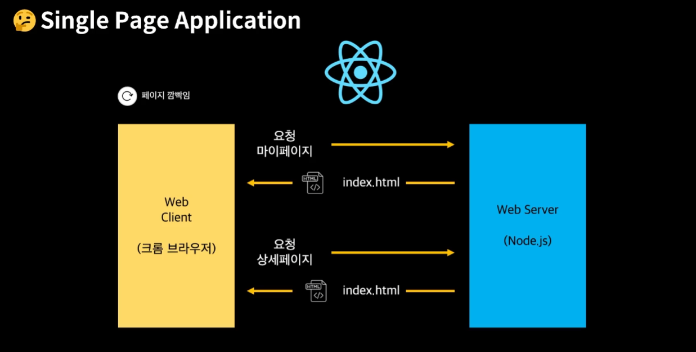

# SPA, MPA

## MPA(Multi Page Application)

> 여러페이지로 구성된 웹 어플리케이션이다.

<figure><figcaption></figcaption></figure>

사용자의 클릭과 같이 인터렉션이 발생할 때마다 서버로부터 새로운 `html`을 받아와서 해당 링크로 이동하여 페이지 전체를 새로 렌더링하는 전통적인 웹페이지 구성 방식이다.

- 새로고침이 발생되어 사용성이 좋지 않다.
- 변경이 필요없는 부분까지 포함하여 전체 페이지를 갱신하므로 비효율적이다.

## SSR(Server Side Rendering)

> 서버에서 사용자에게 보여줄 페이지를 모두 구성하여 사용자에게 페이지를 보여주는 방식

- `SSR`을 사용하면 모든 데이터가 매핑된 서비스 페이지를 클라이언트(브라우저)에게 바로 보여줄 수 있다.
- 서버를 이용해서 페이지를 구성하기 때문에 클라이언트에서 구성하는 `CSR(client-side-rendering)`보다 페이지를 구성하는 속도는 늦어지지만 전체적으로 사용자에게 보여주는 콘텐츠 구성이 완료되는 시점은 빨라진다는 장점이 있다.

### 동작방식

1. 사용자가 페이지를 방문하면 브라우저가 서버에게 페이지 콘텐츠를 요청한다.
2. 서버는 렌더링 준비를 마친 `HTML`과 `JS코드`를 브라우저에 응답을 전달한다.
3. 브라우저에서는 전달 받은 페이지를 띄우고 이어 `JS코드`를 다운받는다.
4. 페이지는 동적인 준비를 끝마친다.

<figure><figcaption></figcaption></figure>

> 💡 초기에는 HTML만 렌더링 되기때문에 JavaScript코드가 다운로드 되기전까지 인터렉션이 발생하지 않는다.

### 장점: 향상된 SEO, 빠른 초기 구동

- 렌더링준비를 마친 `HTML`이 담겨진채로 브라우저에 전달되기 때문에 검색엔진 최적화에 유리하다.
- 검색 엔진이 추가적인 `JavaScript`를 실행하여 분석할 필요가 없다.

### 단점: 잦은 요청, 빈번한 렌더링

- `TTV(Time To View)`와 `TTI(Time To Interact)`간에 시간 간격이 존재한다.
- 매 페이지 로딩시마다 서버에 요청하므로 서버에 부하를 준다.
- 인터렉션이 발생할때마다 전체적인 웹사이트를 `rerender`한다.

> TTV: 사용자가 웹사이트를 볼수 있는 시간  
> TTI: 사용자가 클릭을 하거나 인터렉션이 가능한 시간

## SPA(Single Page Application)

> 하나의 페이지로 구성된 웹 어플리케이션 이다.

<figure><figcaption></figcaption></figure>

> SPA는 기본적으로 웹 애플리케이션에 필요한 모든 정적 리소스를 최초 접근시 단 한번만 다운로드한다. 이후 페이지 요청시, 페이지 갱신에 필요한 데이터만을 JSON으로 전달받아 페이지를 갱시한다.

- 전체적인 트래픽을 감소시킬수 있다.
- 전체 페이지를 다시 렌더링하지 않고 변경되는 부분만을 갱신하므로 새로고침이 발생하지 않아 매끄러운 사용자 경험을 제공한다.

## CSR(client Side Rendering)

> 사용자의 요청에 따라 필요한 부분만 응답 받아 렌더링하는 방식

### 동작방식:

1. 사용자가 페이지를 방문하면 브라우저가 서버에게 페이지 콘텐츠를 요청한다.
2. 서버는 빈껍데기의 HTML을 브라우저에 응답해준다.
3. 브라우저에서는 JS코드를 다운받아 렌더링 준비 후 페이지를 화면에 띄운다.
4. 페이지는 동적인 준비를 끝마친다.

<figure><figcaption></figcaption></figure>

### 장점: 빠른속도, 서버 부하 감소, 사용자 친화적 

- 클라이언트 사이드 렌더링 방식은 변경된 부분과 관련된 데이터만 가져오므로 서버사이드 렌더링보다 빠른속도를 보인다.
- 서버는 초기에 빈HTML만 전달한다.
- 변경된 부분만 요청함으로써 서버의 부담을 줄인다.
- 페이지 안에서 렌더링 하기때문에 깜빡임 없이 부드러운 이동을 경험

### 단점: 초기 구동 속도, SEO

- SPA는 웹 애플리케이션에 필요한 모든 정적 리소스를 최초에 접근시 단 한번 다운로드 하기 때문에 초기 구동 속도가 상대적으로 느리다.