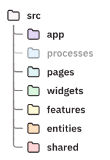

# Layer 번역 및 정리

Feature-Sliced Design(FSD) 아키텍처에서 레이어의 목적은 코드가 얼마나 많은 책임을 가지는지, 그리고 앱 내에서 얼마나 많은 다른 모듈에 의존하는지에 따라 코드를 분리하는 것이다.

> 참고: 이 페이지에서 모듈은 애플리케이션의 내부 모듈을 의미하며, 인덱스 파일을 포함한 파일 또는 디렉토리를 가리킨다. npm 패키지와 혼동하지 말자.

각 레이어는 코드 내에서 모듈에 얼마나 많은 책임을 할당해야 하는지를 결정하는 데 도움이 되는 특별한 의미를 가지고 있다. 레이어의 이름과 의미는 Feature-Sliced Design으로 구축된 모든 프로젝트에서 표준화되어 있다.

총 7개의 레이어가 있으며, 가장 높은 책임과 의존성에서 가장 낮은 책임과 의존성 순으로 배열된다.

- 파일 시스템 트리에는 단일 루트 폴더 `src`가 있으며, 그 안에 7개의 하위 폴더가 있다
  - : `app`, `processes`, `pages`, `widgets`, `features`, `entities`, `shared`

<div style="display: flex; justify-content: space-between; align-items: flex-start;">
    <div style="flex: 1; padding-right: 10px;">
        <ol>
            <li><strong>App</strong></li>
            <li>Process (더 이상 사용되지 않는다)</li>
            <li>Pages</li>
            <li>Widgets</li>
            <li>Features</li>
            <li>Entities</li>
            <li>Shared</li>
        </ol>
    </div>
    <div style="flex: 1; padding-left: 10px;">
        <figure>
            
            <figcaption>FSD 아키텍처 구조</figcaption>
        </figure>
    </div>
</div>

> 모든 프로젝트에서 모든 레이어를 사용해야 하는 것은 아니다. 프로젝트에 가치를 더한다고 생각하는 경우에만 추가하면 된다.

## Import rule on layers

Feature-Sliced Design에서 레이어는 모듈의 응집도가 높은 그룹인 슬라이스(slices)로 구성된다.  
FSD는 낮은 결합도(low coupling)를 지향하기 때문에, 슬라이스 간의 의존성은 레이어에 따른 import 규칙으로 규제된다.

> 슬라이스의 모듈은 자신보다 아래 레이어에 위치한 슬라이스의 코드만 import할 수 있다.

```bash
📦features
 ┣ 📂aaa
 ┃ ┣ 📂api
 ┃ ┃ ┣ 📜request.ts
```

`~/features/aaa/api/request.ts` 파일은 `~/features/bbb`의 다른 모듈에서 코드를 import할 수 없다. 그러나 `~/entities`나 `~/shared`에 있는 코드와 `~/features/aaa`의 같은 슬라이스에 있는 형제 코드는 import할 수 있다.

이 규칙은 모듈 간의 의존성을 명확하게 유지하고, 코드의 재사용성과 유지보수성을 높이는 데 도움이 된다.

## Layer definitions

### Shared

`shared` 레이어는 프로젝트나 비즈니스의 구체적인 내용과는 분리된 독립적인 모듈, 컴포넌트 및 추상화들로 구성된다. 이 레이어는 다른 레이어와 달리 슬라이스(`slice`)로 구성되지 않고, 직접적으로 세그먼트(`segments`)로 구성된다.

**예시 콘텐츠 :**

- 공용 UI
- API 클라이언트
- 브라우저 API를 사용하는 코드

---

### Entities

`Entities` 레이어는 프로젝트의 본질을 구성하는 현실 세계의 개념들을 나타낸다. 일반적으로 비즈니스에서 제품을 설명하는 데 사용하는 용어들이다.

이 레이어의 각 슬라이스는 정적 UI 요소, 데이터 저장소, 그리고 CRUD 작업을 포함한다.

슬라이스 예시

- **소셜 네트워크를 위한 슬라이스:**

  - User (사용자)
  - Post (게시물)
  - Group (그룹)

- **Git 프론트엔드(예: GitHub)를 위한 슬라이스:**
  - Repository (저장소)
  - File (파일)
  - Commit (커밋)

**TIP.**  
FSD 아키텍처에서 상위 엔터티를 관리할 때의 어려움과 이를 해결하는 방법  

**상위 엔터티 관리의 어려움**  
상위 엔터티는 하위 엔터티를 포함하는 구조를 가지며, 이를 관리할 때 계층 간의 import 규칙을 위반하는 경우가 발생할 수 있다. 이러한 상황에서는 상위 엔터티와 하위 엔터티 간의 의존성을 조정하는 것이 중요하다.

1. UI 슬롯 사용

- 엔터티의 UI는 하위 엔터티가 삽입될 수 있는 슬롯을 포함해야한다.

2. 비즈니스 로직 분리

- 엔터티 간 상호작용과 관련된 비즈니스 로직은 주로 Features 계층에 배치해야 한다.

3. 타입 정의 분리

- 데이터베이스 엔터티의 타입 정의는 Shared 계층 아래에 추출하여 API클라이언트 옆에 배치할 수있다.

---

### Features

`Features` 레이어는 사용자가 애플리케이션에서 비즈니스 엔티티와 상호작용하여 가치 있는 결과를 얻기 위해 수행할 수 있는 행동을 의미한다.

이 레이어의 각 슬라이스는 사용자에게 가치를 제공하는 액션을 가능하게 하는 인터랙티브 UI 요소, 내부 상태, 그리고 API 호출을 포함할 수 있다.

| **소셜 네트워크에서의 예시** | **Git 프론트엔드(GitHub 같은)에서의 예시** | **사용자를 대신한 자동화 작업**                       |
| ---------------------------- | ------------------------------------------ | ----------------------------------------------------- |
| 사용자 인증 (Authenticate)   | 파일 편집 (Edit a file)                    | 다크 모드 감지 (Detect dark mode)                     |
| 게시물 작성 (Create a post)  | 댓글 작성 (Leave a comment)                | 백그라운드 연산 수행 (Perform background computation) |
| 그룹 가입 (Join a group)     | 브랜치 병합 (Merge branches)               | User-Agent 기반 작업 (User-Agent-based actions)       |

---

### Widgets

`widgets` 레이어는 엔티티나 피처와 같은 하위 레벨의 유닛들을 조합해 만들어진 자급자족 UI블록이다.

이 레이어는 엔티티의 UI에서 남겨진 슬롯을 다른 엔티티나 피처의 인터렉티브 요소로 채우는 방식으로 구성된다. 따라서 이 레이어에는 일반적으로 “비즈니스 로직이 포함되지 않으며, 비즈니스 로직은 `Features` 레이어에 두는 것이 일반적이다.

떄로는 비즈니스 로직을 이 레이어에 두는 것이 편리할 때도 있다. 특히 위젯이 매우 인터랙티브하고( 인터랙티브 데이터 테이블 ), 그 내부의 비즈니스 로직이 다른 곳에서는 사용되지 않을 때 그렇다.

### 슬라이스 예시:

| **소셜 네트워크에서의 예시**                           | **Git 프론트엔드(GitHub 같은)에서의 예시**                       |
| ------------------------------------------------------ | ---------------------------------------------------------------- |
| 게시물 카드 (Post card)                                | 저장소의 파일 목록 (List of files in a repository, with actions) |
| 사용자 프로필 헤더 (User profile header, with actions) | 스레드의 댓글 (Comment in a thread)                              |
|                                                        | 저장소 카드 (Repository card)                                    |

이 레이어는 UI의 유연한 구성을 가능하게 하고, UI 요소의 재사용성을 극대화하는 데 중점을 둔다.

---

### Pages와 Widgets의 차이점

| **특징**          | **Widgets 레이어**                                                                               | **Pages 레이어**                                                                                                   |
| ----------------- | ------------------------------------------------------------------------------------------------ | ------------------------------------------------------------------------------------------------------------------ |
| **목적**          | 재사용 가능한 자급자족형 UI 블록을 정의하여 다른 컴포넌트와 함께 조합하여 사용                   | 전체적인 페이지나 화면을 구성하여 사용자에게 완전한 경험을 제공                                                    |
| **구성 요소**     | 엔티티(Entity)와 피처(Feature)를 조합하여 만들어진 UI 요소로, 비즈니스 로직은 거의 포함되지 않음 | 여러 위젯과 피처를 결합하여 구성된 더 큰 규모의 UI 요소로, 데이터 페칭, 로딩 상태, 에러 핸들링 같은 로직 포함 가능 |
| **비즈니스 로직** | 거의 포함되지 않음. 주로 제스처나 키보드 상호작용 등 비즈니스와 무관한 로직을 포함               | 데이터를 가져오거나 에러를 처리하는 등의 비즈니스 로직을 포함할 수 있음                                            |
| **사용 사례**     | 다른 UI 요소나 페이지에 삽입될 수 있는 독립적인 컴포넌트로 사용됨                                | 라우터에 직접 연결되어 사용자가 접근할 수 있는 완전한 페이지나 화면을 정의함                                       |
| **예시**          | 사용자 프로필 헤더, 게시물 카드, 파일 목록 등으로, 다른 페이지나 위젯에 포함되어 사용됨          | 뉴스 피드, 사용자 프로필 페이지, 저장소 페이지 등과 같이 라우터를 통해 접근할 수 있는 완전한 페이지로 사용됨       |
| **스케일**        | 작은 규모의 독립적인 UI 요소. 보통 특정 기능에 집중된 컴포넌트                                   | 큰 규모의 전체 화면이나 페이지, 여러 UI 요소와 기능이 결합되어 있음                                                |
| **구현 방식**     | 엔티티와 피처를 결합해 특정한 인터랙션을 중심으로 구성됨                                         | 여러 위젯과 기능을 결합하여 전체 화면을 구성하며, 라우팅, 데이터 페칭, 에러 처리 등도 포함됨                       |

[출처](https://feature-sliced.design/docs/reference/layers)
