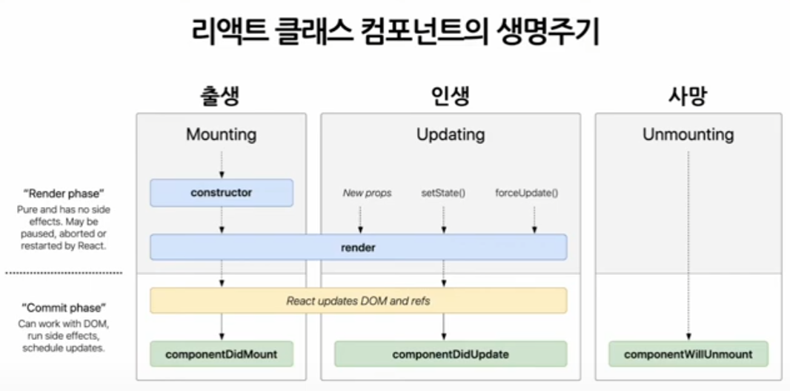

# LifeCycle 

> React 컴포넌트의 생성부터 소멸 까지의 과정을 의미한다.

라이프사이클 메소드를 사용하여 컴포넌트가 DOM에 삽입되는 시점,  업데이트 되는 시점, 제거되는 시점 등에 필요한 로직을 실행할 수 있다.

<figure><figcaption></figcaption></figure>

`LifeCycle` 은 크게 3가지의 단계로 나뉜다.

- 마운팅(Mounting)
- 업데이트(Upating)
- 언마운팅(Unmounting)

---

## 마운팅(Mounting)

> 마운팅은 컴포넌트가 DOM에 삽입되는 단계이다. 

### constructor(props)

컴포넌트의 생성자 메소드로, 컴포넌트 생성시 가장 먼저 실행된다.
초기상태(state)를 설정하거나 메소드 바인딩을 할 때 사용된다. 

### static getDeriveStateFromProps(props.state) 

컴포넌트가 마운트되기 직전과 업데이트될 때 호출된다. 상태를 props에 동기화할 때 사용된다.

### render

컴포넌트가 화면에 렌더링되는 내용을 반환한다. JSX 또는 React요소를 반환해야 하며, 여기서는 DOM을 변경하거나 데이터를 가져와서는 안된다.

### componentDidMount()

컴포넌트가 마운트되고 나서 즉시 호출된다. DOM노드에 접근하거나, 외부 데이터를 불러오는 API호출, 구독 설정 등의 작업을 여기서 수행한다.

---

## 업데이트(Updating)

컴포넌트의 props 또는 state가 변경되었을 때 발생하는 단계이다.

### ShouldComponentUpdate(nextProps, nextState)

컴포넌트가 업데이트를 할지 말지 결정한다. 성능 최적화를 위해 사용된다.

### getSnapshotBeforeUpdate(prevProps, prevState)

업데이트가 DOM에 적용되기 직전 호출된다.  
반환된 값은 componentDidUpdate()에 인자로 전달된다.  

### componentDidUpdate(prevProps, preState, snapshot)

업데이트가 DOM에 적용된후 호출된다. 이전 props와 state를 이용해 컴포넌트가 업데이트 된후의 작업을 수행한다.

---

## 언마운팅(Unmounting)

컴포넌트가 DOM에서 제거될 때 발생하는 단계이다.

### componentWillUnmount()

컴포넌트가 언마운트 되기 직전에 호출된다  
여기서 타이머 제거, 네트워크 요청취소, 구독 해제등 필요한 정리 작업을 수행한다. 