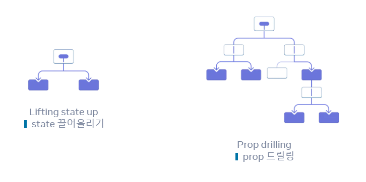
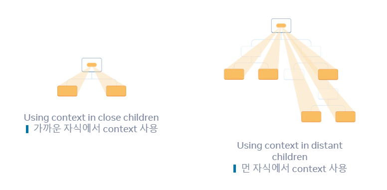

# React Hooks

## React Hook이란 ?

React Hooks는 React 16.8 버전에서 도입된 기능으로, 함수형 컴포넌트에서 상태(state)와 생명주기(lifecycle) 같은 React 기능들을 hook 할 수 있게 해주는 함수들이다.

\*hook : 연동

### 역사 및 필요성

React Hooks는 2018년 React팀에 의해 소개되었다. 그 전까지는 상태관리와 생명주기 기능을 사용하기 위해서는 클래스 컴포넌트를 사용해야만 했다.

**필요성** : Hooks는 여러 가지 문제를 해결하기 위해 도입되었다.

**WraaperHell( Highr-order Components, HOC)**\
\= 여러 계층의 컴포넌트를 감싸여 재사용 로직의 문제를 해결 할 수 있었지만, 가독성이 떨어지고 구조가 매우 복잡해지는 문제가 발생

**Huge Components**\
\= 생명주기 메서드를 통해 상태관리, 데이터 로딩, 이벤트 리스닝 등을 처리하여 관련없는 로직들이 여러 메소드에 걸쳐 있어 컴포넌트를 복잡하게 만들었다.

**Confusing Classes**\
\= this 키워드의 동작의 이해나, 복잡한 생명주기 메서드, 클래스 문법의 어려움이 혼란을 가져온다.

Hooks는 이러한 문제들을 해결하여, 코드의 재사용성을 높이고, 컴포넌트를 더 쉽게 이해하고 사용할 수 있게 만들어준다.

### 특징

**상태 관리** : `useState`를 사용하여 상태를 관리할 수 있다.\
**사이드 이펙트 처리** : `useEffect`를 사용하여 데이터 가져오기, 구독설정, 수동으로 DOM 조작과 같은 `side effets`를 처리한다.\
**코드 재사용과 로직 공유** :  사용자 정의 Hook을 통해 컴포넌트 간에 상태 관련 로직을 쉽게 재사용할 수 있다.&#x20;


### useState

상태를 관리 할 수 있는 훅\
`const [state, setState] = useState(initiaState)`

* state는 현재의 상태를 나타낸다.
* set함수를 사용하면 상태를 다른 값으로 업데이트하고 렌더링을 다시 트리거 할 수 있다.

React의 state는 배치업데이트 방식을 통해 처리된다.

> React는 state 업데이트를 하기 전에 이벤트 핸들러의 모든 코드가 실행될때까지 기다린다.

state 변수를 설정하면 다음 렌더링이 큐에 들어간다.

```jsx
setNumber(number + 5);
// 현재의 state에 +5를한다.
setNumber(n => n+1);
// n => n + 1 업데이터 함수이므로 큐에 추가한다.
setNumber(42);
// state를 42로 교체한다.
```

1. state를 설정하더라도 기존 렌더링의 변수는 변경되지 않는다. 대신 새로운 렌더링을 요청한다.
2. React는 배치 업데이트를 위해 이벤트 핸들러가 실행을 마친 후 state를 업데이트 처리한다.
3. 하나의 이벤트에서 일부 state를 여러번 업데이트 하려면 setNumber(n => n+1) 업데이터 함수를 사용할 수 있다.

> 업데이트 함수는 렌더링중에 발생하므로 순수해야하고 결과만 반환해야한다.\
> 업데이트 함수 내부에서 다른 state를 변경하거나 다른 사이드 이펙트를 실행하면 안된다.

### useEffect

React의 함수형 컴포넌트에서 Side effects을 처리하기 위해 사용되는 훅

> Effect를 사용하면 렌더링 이후 일부 코드를 실행할 수 있으므로 컴포넌트를 React외부의 시스템과 동기화할 수 있다.

즉 `useEffect` 는 해당 렌더링이 화면에 반영 될 때까지 코드의 실행을 "지연"한다.

props나 state가 변경될 때 컴포넌트의 state를 업데이트하려는 경우에는 Effect가 필요하지 않다. 불필요한 Effect를 제거하면 코드를 더 쉽게 따라갈 수 있고, 실행 속도가 빨라지며, 오류 발생 가능성이 줄어든다.

#### 이유

effect는 렌더링 이후에 발생한다. 하지만 React에서 렌더링은 state나 props가 변했다는 것을 의미한다. 단순 렌더링을 위해 state를 변화시켜 effect를 발생시킨다면 두번의 렌더링을 발생시키는 비효율적인 계산이 된다.

사용자 이벤트를 처리하는 데에는 Effect가 필요하지 않다.\
이벤트 핸들러에서는 정확히 어떤 일이 일어났는지 알 수 있지만 effect는 사용자가 무엇을 했는지를 알 수 없다.

React에서 렌더링은 JSX의 순수한 계산이어야 한다. DOM 수정과 같은 사이드 이펙트를 포함해서는 안된다.

#### 의존성

기본적으로 Effect는 매번 렌더링 후에 실행된다. \
의존성 배열을 지정하면 매번 렌더링 후에 실행되지 않고 의존성 배열의 상태가 변경이되면 실행이 된다.

```jsx
useEffect(() => {
  // This runs after every render
  // 렌더시마다 실행됩니다.
});

useEffect(() => {
  // This runs only on mount (when the component appears)
  // 오직 마운트시(컴포넌트가 나타날 때)에만 실행됩니다.
}, []);

useEffect(() => {
  // This runs on mount *and also* if either a or b have changed since the last render
  // 마운트시 뿐만 아니라 a 또는 b가 직전 렌더와 달라졌을 때에도 실행됩니다.
}, [a, b]);
```

#### return설정 (클린업 함수)

React는 Effect가 다시 실행되기 전에 매번 클린업 함수를 호출하고컴포넌트가 마운트 해제 될 때 마지막으로 한 번 더 호출한다.

useContext

컴포넌트에서 context를 읽고 구독할 수 있게 해주는 ReactHook이다.

context란&#x20;

React를 사용하다보면 부모 컴포넌트에서 하위 컴포넌트로 prop을 전달하는 과정의 tree가 깊어지면 중간에 여러 컴포넌트를 거쳐야 하므로 불편해질 수 있다. 이러한 현상을 prop drilling이라고 한다.\
context는 부모컴포넌트의 자식 컴포넌트에게 직접 상태를 전파 할 수 있는 방법이다.

<figure><figcaption></figcaption></figure>

<figure><figcaption></figcaption></figure>

#### step 1 : Create the context

: 하위 트리에 전파할 context를 생성한다.

```jsx
import { createContext } from 'react';

export const LevelContext = createContext(1);
```

#### step 2 : Use the context

: React와 context에서 `useContext` Hook을 가져온다.

```jsx
export default function childComponent {
	const level = useContext(LevelContext);
}
```

`useContext`는 React에게 자식 컴포넌트가 `LevelContent`를 읽기를 원한다고 알려준다.

#### step 3 : Provider the context

: context 제공하기\
context provider로 감싸 `LevelContext`를 제공해야한다.

```jsx
import { MyContext} from './MyContext.js';

<MyContext.Provider value={/* 어떤 값 */}>
  {/* 컴포넌트 트리 */}
</MyContext.Provider>
```

Context를 활용하면 PropsDrilling 문제와 효율적인 lifting stateup을 할 수 있지만 하나의 context에서 많은 데이터나 복잡한 데이터 구조를 관리하면 재사용성과 테스트가 어려워진다.

또한 context값을 변경할때마다 해당 context를 사용하는 모든 컴포넌트가 리렌더링 되기 때문에 적절한 단위로 분리하여 사용해야 한다. 많은 context로 상태를 관리하는 것도 효율이 떨어지므로 구조가 큰 경우 Redux, Mobx, Recoil와 같은 상태관리라이브러리를 사용하자

### useRef

컴포넌트의 생애주기 전체에 걸쳐서 유지되는 객체. 즉, 컴포넌트가 없어질 때 까지 동일한 객체가 유지된다.

Ref는 바뀌어도 렌더링에 영향을 주지 않는다.

useRef를 사용하여 DOM요소에 직접 접근 할 수 있다.
