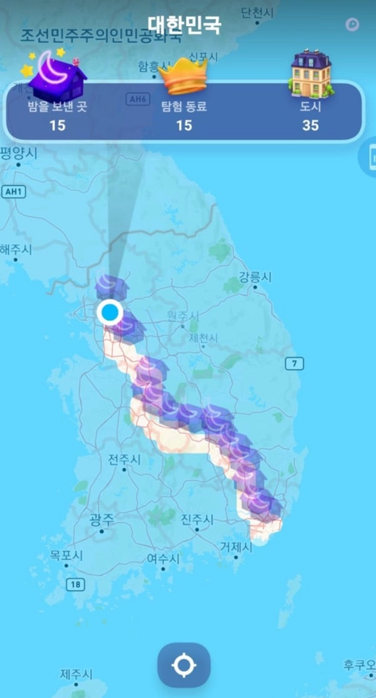
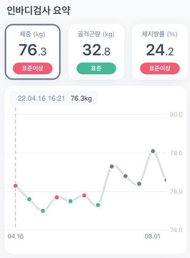
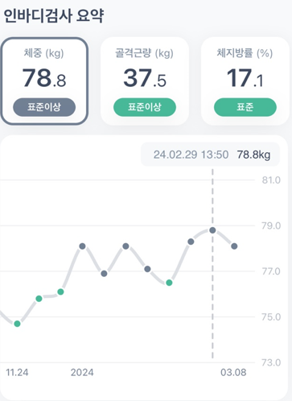

# 실행력을 기르기 위한 도전

<figure>
    
    <figcaption></figcaption>
</figure>

## 2021년 12월 17 ~ 2022년 1월 1일 국토 대장정 완주

### 경로

> 부산역 -> 김해 -> 밀양 -> 청도 -> 대구 -> 칠곡왜관 -> 구미 -> 김천 ->  
> 영동 -> 옥천 -> 신탄진 -> 청주 -> 진천 -> 안성 -> 오성 -> 서울역

### 도전 동기

보안 전문가에서 프론트엔드 개발자로 진로를 전환하기 위한 목표 의식을 다지기 위해 도전했습니다. 늘 생각만 하고 실천하지 못하는 태도를 바로잡기 위해, 한겨울에 부산에서 서울까지 국토 대장정을 완주했습니다. 이 도전은 새로운 길을 향한 결단력과 실행력을 키우기 위한 중요한 경험이었습니다.

## 목표를 성취하는 습관

<figure style="display: flex; gap: 20px;">
    
        
    <figcaption></figcaption>
</figure>

### 도전 동기

강인한 육체에서 강인한 정신이 나온다고 믿었습니다. 목표 의식을 유지하고 멘탈을 바로잡기 위해 체력 단련이 필요하다고 생각했습니다. 그래서 헬스장에 등록하고 하루 2시간씩, 주 5회 이상 체력 단련을 통해 하루를 시작했습니다. 이 꾸준한 노력을 통해 다음과 같은 결과를 얻었습니다:

- 체력 강화: 지속적인 운동을 통해 강인한 육체를 만들었습니다.
- 정신적 강인함: 강한 육체는 강한 정신을 불러왔습니다.
- 전문가 수준의 지식: 체력 단련에 대한 깊은 이해와 지식을 습득했습니다.

주위 사람들은 저를 "헬창"이라고 부릅니다. 그러나 저는 하루 중 2시간을 헬스에 투자할 뿐입니다. 나머지 시간은 오로지 프론트엔드 개발에 집중 했습니다. 체력 단련은 단순한 운동이 아니라, 목표를 성취하는 습관을 기르는 중요한 과정이었습니다. 이를 통해 저는 목표를 향해 나아가는 데 필요한 강한 의지와 실행력을 기를 수 있었습니다.
