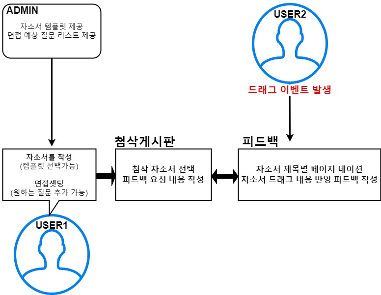
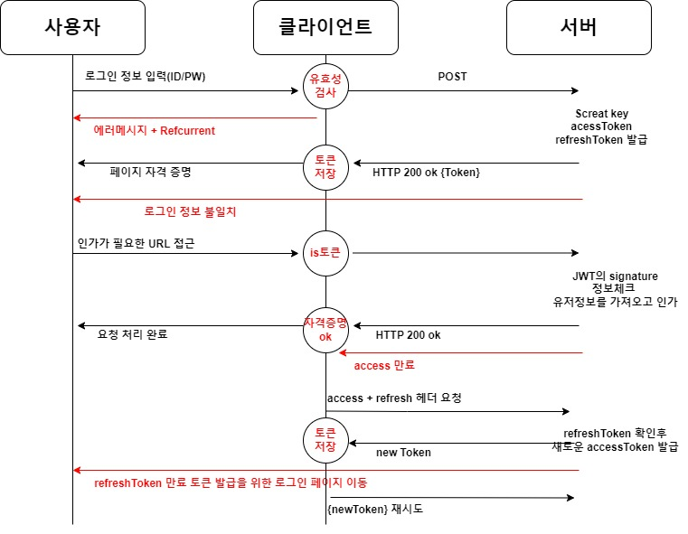
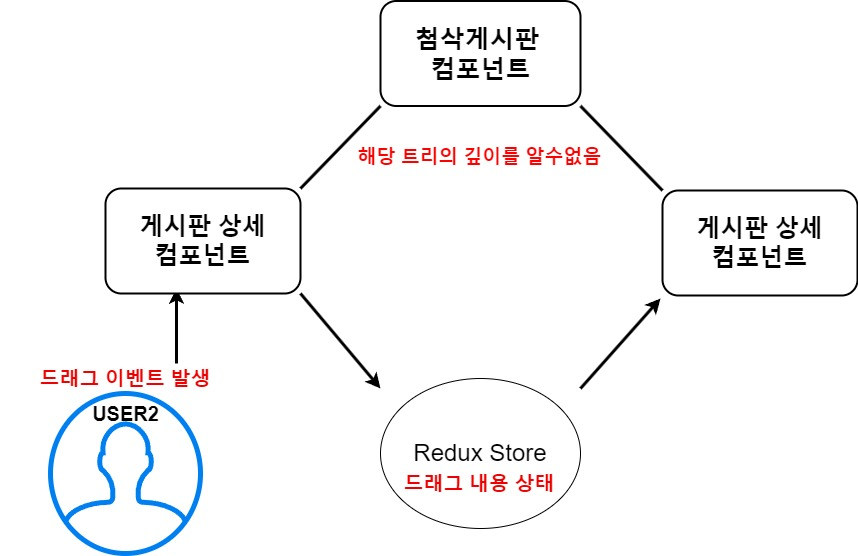

# 인자강 세부 내용

## 코드 구조 및 디렉토리 규칙:

#### 리덕스

```shell
📦Template
┣ 📂server
┃ ┣ 📜actions.tsx
┃ ┣ 📜reducer.tsx
┃ ┗ 📜types.tsx
┗ 📂user
┃ ┣ 📜actions.ts
┃ ┣ 📜reducer.ts
┃ ┗ 📜types.ts
```

: server와 client 상태를 분리 하여 관리

#### 컴포넌트

```shell
📦MyProfile
┣ 📂hooks
┃ ┣ 📜useMyProfileLogic.ts
┃ ┗ 📜useMyProfileManager.ts
┣ 📜CheckMyInFo.tsx
┣ 📜PassWordSetting.tsx
┗ 📜UserInfoSetting.tsx
```

: 컴포넌트의 공통적인 로직은 use\*\*Logic 에서 관리  
thunk와 관련된 상태는 useMyProfileManager에서 관리  
컴포넌트는 렌더링에 집중  
프로젝트가 특정 라이브러리 의존하는 것을 최소화

## 내부 아키텍처

### 이력서 첨삭 게시판 아키텍처

<figure>
    
</figure>

### 인터뷰 아키텍처

<figure>
    
</figure>

### 토큰 처리 방식

<figure>
    
</figure>

## 프로젝트 고민 사항

### 토큰을 어떻게 저장?

토큰 저장 방식을 결정할 때, 보안 측면에서 중요한 고려사항을 직면했습니다. 로컬 스토리지에 토큰을 저장하는 방식은 XSS(Cross-Site Scripting) 공격에 취약한 단점이 있습니다. 반면, 쿠키에 토큰을 저장하는 방법은 CSRF(Cross-Site Request Forgery) 공격에 취약할 수 있습니다. 하지만, XSS 공격을 방어하는 데는 다양한 우회 방법이 존재하는 반면, CSRF는 Referer 검증을 통해 보안 문제를 해결할 수 있다고 판단했습니다. 이러한 이유로, 쿠키를 사용하여 토큰을 저장하는 방법을 채택하게 되었습니다.

---

### 헤더에 JWT 정보 요청시 처리 방법 개선

매요청시마다 직접 토큰을 쿠키에서 꺼내어 헤더에 담아 보내주었습니다.

- 쿠키에서 꺼내는 반복되는 코드
- 쿠키에서 꺼내어 헤더에 담는 과정으로 인한 가독성 저하

`axios.interceptors`를 이용하여 요청을 가로채어 토큰을 실어 보내주었습니다.

- 반복되는 코드 없음
- 필요시 요청하면 자동으로 토큰처리

**토큰 존재 유무 판단**

- 토큰이 없는 경우는 로그인이 처리되지 않은 상태로 판단하여 로그인 페이지로 이동

---

### refreshToken에 대한 처리에 대한 고민

> 기존방식 : 커스텀 미들웨어 방식으로 처리  
> 핵심 : 액션을 가로채어 \_FAILURE일 경우 status 401일 경우 메시지 저장

(메시지 조건 처리)

- 해당하는 유저를 찾을 수 없습니다.
- 권한이 없습니다.

  - 토큰 만료 -> 로그인 페이지

- JWT가 만료되었습니다.
  - Reissue 처리
  - 에러 : 리프레시 토큰 메시지 확인
  - 로그인 페이지 이동
- `dispatch({type: action.type, payload: {error}});` 결과 전달

**문제점 :**

- 리덕스 특성상 한번에 하나의 액션처리에 대한 결과만 처리 가능
- 메시지 상태의 의존적이다.  
  <br/>

---

<br/>

> 개선방식 : `axiios.interceptor`를 이용한 방식  
> 핵심 : API 응답을 가로채어 status 401 확인  
> 포인트 : 선언적인 코드의 형태

1. `handleErrorMessage(errorMessage ,config) `

   - token 만료 메시지 확인 -> jwtExpired(message, originRequest)
   - 그외 정상 응답 처리

2. `jwtExpired`

   - `tokenReissueAPI` 요청
   - `refreshToken` 검증 완료 `accessToken` 교체
   - 실패요청 (재시도)
   - `refreshToken` 검증 실패시 `refreshToken` 만료로 `unauthorized` 처리

3. `unauthorized`
   - 토큰 재발행을 위한 로그인 페이지 안내

---

### props드릴링 해소 : 대표적 사례

<figure>
    
</figure>

**문제 :** 첨삭 게시판에서 사용자가 텍스트를 드래그하여 선택한 후, 해당 상태를 피드백 컴포넌트에 반영하는 과정에서 컴포넌트를 분리하다 보면 props drilling 문제를 겪을 수 밖에 없었습니다.

**해결 :** 텍스트 드래그 이벤트의 상태를 리덕스 스토어에 저장하여 관리함으로써, 상태 전달 과정이 단순화 되어 피드백 컴포넌트에서 저장소에 접근하면 바로 반영 할 수 있게 되었습니다.

**장점 :** 컴포넌트간의 결합도를 낮추고, 유지보수성과 확장성이 높아졌습니다.

### thunk 사용한 이유

프로젝트를 진행하면서 비동기 로직 처리에 있어서 Redux-Saga와 Redux-Thunk 선택에서 고민을 하였습니다. Saga의 Generator함수를 활용하는 접근 방식은 흥미로웠지만, 당시 저의 Generator 문법에 대한 이해도가 부족한점와 단독으로 구현해야 할 기능이 많은 점, 프로젝트 특성상 복잡한API처리를 다루지 않음으로 Thunk의 단순함이 프로젝트 요구사항에 더 잘 부합하다 생각했습니다. 결과적으로 Thunk는 프로젝트의 비동기 로직을 효율적으로 관리하면서도 구현의 부담을 최소화하는 선택이였습니다.
