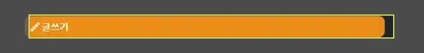
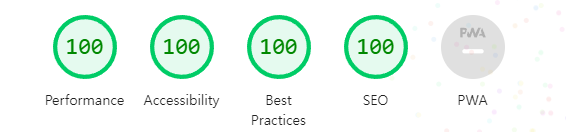

# 라이트 하우스 점수 향상기

## Lighthouse란 무엇인가?

LightHouse는 Google에서 개발한 오픈 소스 자동화 도구로, 웹 페이지의 품질을 개선하기 위해 사용된다.

- 성능 , 접근성, SEO(검색 엔진 최적화),PWA(Progressive Web App) 적합성 평가 및 점수 측정
- LightHouse는 Chrome DevTools, Node, CLI을 통해 실행할 수 있다.

상세한 내용 : [detail](/BASE/Lighthouse.md)

## 성능 최적화 경험기 : 91점에서의 만족

이전에 인자강의 메인 페이지를 라이트하우스(Lighthouse)로 검사한 결과, 개발 모드에서 40점대, 프로덕션 모드에서는 60점이라는 충격적인 점수를 받았습니다. 이에 여러 가지 최적화 작업을 통해 점수를 91점까지 끌어올리며 뿌듯함을 느꼈습니다. 그러나 지금 돌이켜보면, 91점에서 만족할 것이 아니라, 토이 프로젝트 같은 경우는 100점을 목표로 했어야 했습니다.

## 이전 문제 상황

메인 페이지의 경우, 스크롤을 내리면 홈페이지의 기능을 설명하는 문구와 이미지가 뜨는 애니메이션이 발생합니다. 하지만 여기서 사용되는 이미지가 최적화되지 않아 로딩 시간이 지연되는 것이 주요 문제점이었습니다.

## 이전 해결 방법

1. 이미지를 `Webp`형식으로 변환하여 파일용량을 줄였습니다. `webp`의 경우 JPEG나 PNG 포맷에 비해 용량이 작아 로딩 속도를 크게 개선할 수 있습니다.
2. 초기 화면 구성 시 필요하지 않은 후속 기능을 설명하는 이미지 컴포넌트의 경우 `React.lazy`를 활용하여 코드 스플리팅을 분할하였습니다. 이를 통해 초기 로딩 시간을 단축하고, 필요한 시점에만 로딩되도록 하였습니다.

## 성능 최적화 경험기 : 100점을 향해

### 근본적인 문제 파악

> LightHouse의 경고 메시지로는 근본적인 문제를 파악 할 수 없는 상황

1. **레이아웃의 문제 점검**

- 전체 페이지를 공통적으로 구성하는 레이아웃을 점검
- 새로운 페이지를 생성하여 순수 레이아웃의 `score`를 비교해봤습니다.

[ **Score : 100점** ]

2. **컴포넌트의 문제 점검**

- 페이지를 구성하는 컴포넌트의 문제를 검사
- 순수한 레이아웃의 적용 결과, 각각의 컴포넌트를 생성하여 점검했습니다.

[ **예상외의 결과** : 단순 스타일버튼 컴포넌트 최하점 기록 ]

3. **순수한 styled컴포넌트 점검**

- styled 문제를 점검하기 위한 점검 과정
- 아무런 속성이 적용되지 않은 순수한 스타일 컴포넌트를 생성하여 점검 하였습니다.

[**Score : 70점 중후반**]

4. **일반 HTML태그를 점검**

- 일반적인 태그 <`div/`>를 적용한 결과를 점검 하였습니다.
- 일반적인 태그를 사용할 경우 90점대를 기록

[**결론 : Styled자체의 문제일 확률 높음**]

## Styled 문제 해결

이 문제는 이전에 X_clone 프로젝트를 진행하면서 하이드레이션과 관련된 오류를 해결했던 경험과 유사합니다. styled-components와 같은 CSS-in-JS 라이브러리는 프로젝트가 실행 중일 때 DOM 요소에 스타일을 주입합니다. 그러나 서버 사이드 렌더링(SSR)을 사용하는 Next.js에서는 이러한 스타일 주입 과정에서 LCP(Largest Contentful Paint)의 시간 차이가 발생하여 LightHouse 점수가 급격히 떨어질 수 있습니다.

이러한 문제를 해결하기 위해서는 ServerStyleSheet를 활용하여 SSR 방식으로 styled-components를 지원하면 됩니다

관련 문서 : [next-Styled](/Next/StyledComponent.md)

## 접근성 문제 해결 관련 정리

- 웹 페이지가 다양한 사용자, 특히 장애가 있는 사용자에게 얼마나 접근 가능한지를 평가합니다.
- 색 대비, 이미지 대체 텍스트, 폼 레이블 등의 요소를 검토합니다.

---

### Background and foreground colors do not have a sufficient contrast ratio.

> 해당 경고 메시지는 웹 접근성 표준에 따라 텍스트와 배경 색상 간의 대비 비율이 충분하지 않을 때 발생합니다.

**예시** : 배경이 어두운 경우 텍스트는 밝은 색상으로 처리해야 합니다.

<figure>
    
</figure>
 
현재의 경우 버튼을 밝은 색상으로 처리했는데 버튼의 텍스트도 밝은 색상으로 처리하여 발생한 경고입니다.

### <html> element does not have a [lang] attribute

> 해당 경고 메시지는 웹 접근성 및 국제화 문제와 관련된 문제입니다.  
> html 요소에 lang 속성이 없을 때 발생합니다.

- 해당 속성은 문서의 기본 언어를 지정하는데 사용되며, 검색 엔진, 브라우저 및 스크린 리더와 같은 보조 기술이 페이지를 올바르게 해석하고 제공하는 데 도움을 줍니다.

기본적으로 Next.js의 _document 문서에 정의되어 있는데, styled-components의 SSR을 적용하는 과정에서 공식 문서를 참고하는 중에 이 속성이 누락되었습니다.

### Form elements do not have associated labels

> 해당 경고 메시지는 웹 접근성 검사 도구에서 폼 요소에 라벨이 제대로 연결되지 않았을 때 발생하는 일반적인 경고입니다.

- 라벨을 사용하지 않는 경우 보조 기술을 사용하는 사용자들이 폼 요소의 목적을 쉽게 이해하지 못하게 만든다.

[**문제원인**]

- 라벨의 중요성을 인지하지 못하여 발생한 문제입니다
- 화면상 라벨을 표시하는 것이 디자인과 어울리지 않는다고 판단하여 생략했습니다.
- 하지만 이러한 문제는 접근성에서 큰 문제라는 사실을 알게 되었습니다.

[**해결방법**]

CSS의 .sr-only 클래스를 생성하여 글로벌 스타일에 적용했습니다. 이 클래스를 사용하면 시각적으로는 라벨이 보이지 않지만, 스크린 리더 등 보조 기술에서는 라벨을 인식할 수 있습니다.

```css
.sr-only {
  position: absolute;
  width: 1px;
  height: 1px;
  padding: 0;
  margin: -1px;
  overflow: hidden;
  clip: rect(0, 0, 0, 0);
  border: 0;
}
```

## 적용 결과

전반적으로 모든 페이지의 문제는 주로 Styled-components로 인한 것이었습니다. 접근성 측면에서는 라벨을 적용하지 않은 사소한 문제가 컸습니다. 위의 사항들을 해결하여 라이트하우스의 점수를 100점으로 맞추었습니다.

<figure>
    
</figure>
